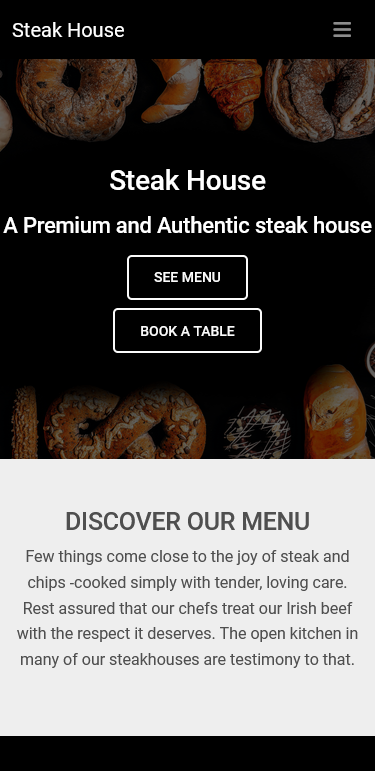

# A resturant Landing page Using Bootstrap v5

## Overview

This project is a simple resturamt landing page using Bootstrap 5. The project was created to demonstrate the use of Bootstrap 5 and how it can be used to create a simple landing page.

> [Live Demo Link](https://fmanimashaun.github.io/Landing_page-bs5/)

## Screenshots

<h3 align="center">Desktop View</h3>

  

<h3 align="center">Tablet View</h3>

  

<h3 align="center">Mobile View</h3>

  

## Built With

- [HTML](https://developer.mozilla.org/en-US/docs/Web/HTML)
- [CSS](https://developer.mozilla.org/en-US/docs/Web/CSS)
- [Material Design Bootstrap (MDB) v5](https://mdbootstrap.com/)

## Authors

👤 **Engr. Animashaun Fisayo**

- [GitHub](https://github.com/fmanimashaun)
- [Twitter](https://twitter.com/fmanimashaun)
- [LinkedIn](https://www.linkedin.com/in/fmanimashaun/)
- [Website](https://fmanimashaun.com)

## 🤝 Contributing

Contributions, issues, and feature requests are welcome!

Feel free to check the [issues page](../../issues/).

## Show your support

Give a ⭐️ if you like this project!

## Acknowledgments

- Hat tip to anyone whose code was used
- [mdbootstrap](https://github.com/mdbootstrap)

## 📝 License

This project is [MIT](./LICENSE) licensed.

